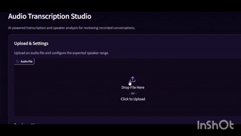
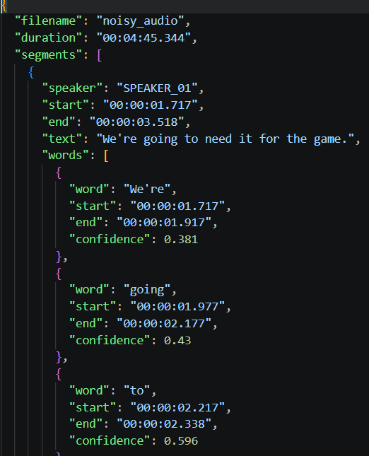
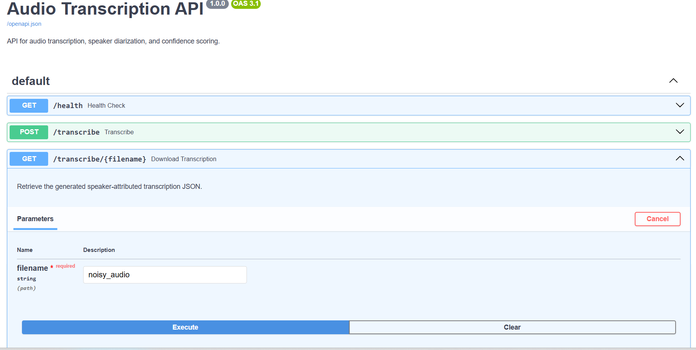
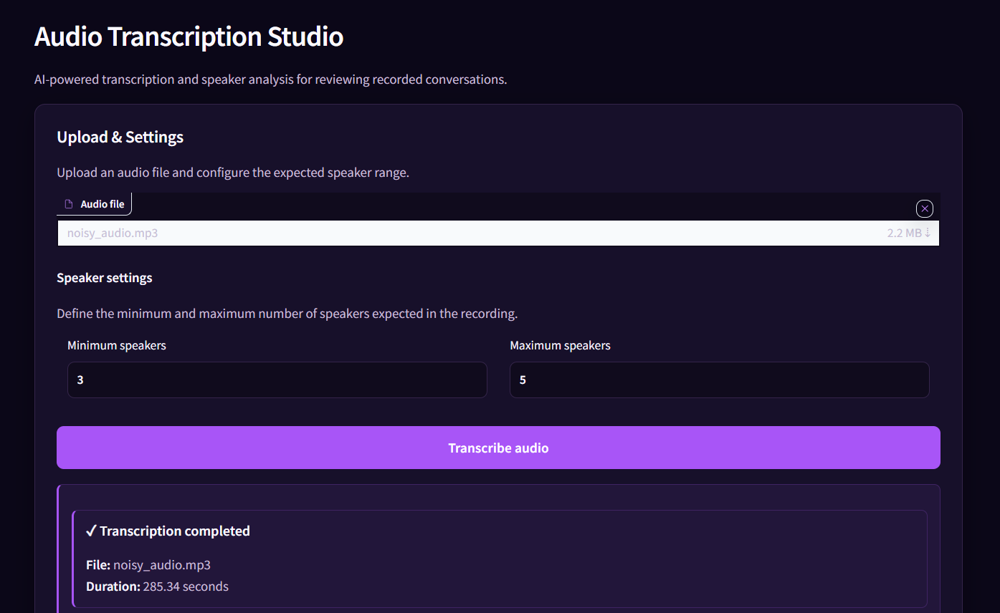
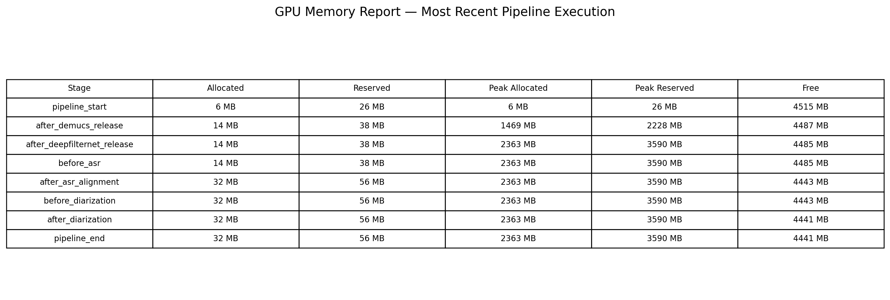

# 🎙️ Audio Transcription & Speaker Diarization

A GPU-accelerated audio intelligence pipeline for speech enhancement, transcription, speaker diarization, word-level confidence scoring, structured output, and interactive transcript review.
---


# 🎬 Demo


### Demo Video

[▶ Watch the full pipeline demonstration](docs/assets/demo_video.mp4)

### Short GIF Preview



---

## 🚀 What This Project Does

Given an audio file, the system:

1. Loads and analyzes the input audio.
2. Creates task-specific enhanced audio versions.
3. Transcribes speech using **WhisperX**.
4. Aligns the transcription to obtain word-level timestamps and confidence scores.
5. Performs **speaker diarization** using pyannote.audio.
6. Assigns speakers to individual words and segments.
7. Produces a structured JSON transcription.
8. Exposes the pipeline through a REST API.
9. Provides an interactive interface for reviewing and searching the generated transcript.

The system is designed as a reusable backend service with an interactive post-processing review interface rather than a one-off transcription script.

---

## 🏗️ Architecture


```text
                         ┌──────────────────┐
                         │    Audio Input   │
                         └────────┬─────────┘
                                  │
                    ┌─────────────┴─────────────┐
                    │                           │
                    ▼                           ▼
             ┌─────────────┐             ┌─────────────┐
             │     CLI     │             │  Gradio UI  │
             │  main.py    │             │ src/ui/app.py│
             └──────┬──────┘             └──────┬──────┘
                    │                           │
                    │                           ▼
                    │                    ┌─────────────┐
                    │                    │ API Client  │
                    │                    └──────┬──────┘
                    │                           │
                    │                           ▼
                    │                    ┌─────────────┐
                    │                    │   FastAPI   │
                    │                    │ src/api/    │
                    │                    │   main.py   │
                    │                    └──────┬──────┘
                    │                           │
                    └─────────────┬─────────────┘
                                  ▼
                         ┌────────────────┐
                         │ AudioPipeline  │
                         └───────┬────────┘
                                 │
                      ┌──────────┴──────────┐
                      │                     │
                      ▼                     ▼
               ┌─────────────┐      ┌───────────────┐
               │   Demucs    │      │ DeepFilterNet │
               │  ASR Path   │      │ Diarization   │
               └──────┬──────┘      └───────┬───────┘
                      │                     │
                      ▼                     ▼
               ┌─────────────┐      ┌───────────────┐
               │  WhisperX   │      │   pyannote    │
               │ ASR + Align │      │ Diarization   │
               └──────┬──────┘      └───────┬───────┘
                      │                     │
                      └──────────┬──────────┘
                                 ▼
                        Speaker Attribution
                                 │
                                 ▼
                         Structured JSON

 ```                   

---

## 🔍 Why Two Audio Enhancement Paths?

The pipeline does not use the same preprocessing strategy for every downstream task.

Instead, it creates task-specific audio:

- **Demucs** → preprocessing for automatic speech recognition.
- **DeepFilterNet** → preprocessing for speaker diarization.

This separation allows each downstream model to receive audio optimized for its specific task.

The enhanced audio is also saved during processing so that the results can be inspected and compared during development.

---

## 🧠 Core Pipeline

The main orchestration logic is implemented in:

```text
src/pipeline/audio_pipeline.py
```

The pipeline follows this sequence:

```text
Input Audio
    ↓
Audio Loading
    ↓
Task-Specific Enhancement
    ├── Demucs → ASR path
    └── DeepFilterNet → Diarization path
    ↓
WhisperX Transcription
    ↓
Word-Level Alignment
    ↓
Speaker Diarization
    ↓
Speaker-to-Word Assignment
    ↓
Structured JSON Output
```


---

## 🎯 Speaker Diarization

The diarization stage uses **pyannote.audio** to identify different speakers within the audio.

The API allows optional speaker constraints:

```text
min_speakers
max_speakers
```

For example:

```text
min_speakers = 2
max_speakers = 5
```

These parameters provide additional control when the approximate number of speakers is known.

The system also supports diarization presets so that the behavior can be configured without exposing every low-level model parameter through the API.

---

## 📝 Structured Output

The final result is saved as structured JSON.

Example:



The pipeline produces structured JSON containing speaker-attributed
segments, timestamps, word-level timing, and confidence information.


Each word can contain:

- Word text
- Start timestamp
- End timestamp
- Confidence score

Each segment contains:

- Speaker
- Start timestamp
- End timestamp
- Transcribed text
- Word-level information

This structured format makes the output suitable for downstream applications.

The complete JSON output is also available for download through the interactive interface.

---

# 🌐 REST API

The processing pipeline is exposed through **FastAPI**.

## Available Endpoints

### Health Check

```http
GET /health
```

Returns:

```json
{
  "status": "ok"
}
```


---

### Transcribe Audio

```http
POST /transcribe
```

Accepts an audio file and optional speaker constraints.

Supported formats:

```text
.wav
.mp3
.m4a
.flac
.ogg
.mp4
```

Optional parameters:

```text
min_speakers
max_speakers
diarization_preset
```

Example response:

```json
{
  "status": "completed",
  "filename": "noisy_audio.mp3",
  "duration": 285.344,
  "transcription_url": "/transcribe/noisy_audio"
}
```

The API validates the request before starting the GPU-heavy processing pipeline.

---

### Retrieve Transcription

```http
GET /transcribe/{filename}
```

Returns the generated speaker-attributed JSON file.

---

### Interactive API Documentation

FastAPI automatically provides interactive documentation at:

```text
http://localhost:8000/docs
```

OpenAPI schema is available at:

```text
http://localhost:8000/openapi.json
```

---

## Interactive Transcript Review

The project also includes a lightweight web interface for reviewing completed transcriptions.

The interface supports:

- Audio playback
- Timestamped transcript segments
- Click-to-seek transcript navigation
- Speaker renaming
- Transcript search
- JSON export




# 🐳 Docker & GPU Setup

The application is containerized using Docker and runs with NVIDIA GPU support.

The Docker environment contains:

- CUDA runtime/development environment
- Python
- PyTorch
- WhisperX
- pyannote.audio
- Demucs
- DeepFilterNet
- FastAPI
- Uvicorn
- FFmpeg and audio processing dependencies

## Environment Configuration

The application requires a Hugging Face access token for downloading the required models.

Create a local `.env` file from the provided example:

```bash
cp .env.example .env
```


Then open .env and add your Hugging Face token:
```text
HUGGING_FACE_TOKEN=your_token_here
WHISPER_MODEL=small.en
```

### 1. Start the backend

Build and start the Docker service with:

```bash
docker compose up --build
```
The API will be available at:

```text
http://localhost:8000
```

Swagger documentation:

```text
http://localhost:8000/docs
```
### 2. Start the interactive UI

With the Docker container running, open a second terminal and start the Gradio interface:
```bash
docker compose exec audio-td python -m src.ui.app
```
The interactive interface will be available at:
```text
http://localhost:7860
```

### 3. Access the running container
For debugging or inspecting the container, you can open a shell with:
```bash
docker compose exec audio-td bash
```
---

## ⚡ Model Caching

Large machine learning models are downloaded during their first use.

The Docker Compose configuration uses persistent volumes for model caches:

```text
torch_cache
huggingface_cache
deepfilternet_cache
```

This means that recreating the application container does not require downloading all models again.

Once the service is running, the core models are initialized when the application starts and remain available for subsequent API requests. Multiple audio files can therefore be processed sequentially without reloading the full model stack for each request.


This avoids repeatedly loading expensive models and reduces unnecessary startup overhead between transcription jobs.

### Execution Model

The current application is designed for **single-job, local GPU execution**.

The FastAPI service keeps the ML pipeline initialized while the application is running, allowing multiple audio files to be processed sequentially without reinitializing the full model stack.

The current implementation is intentionally focused on local GPU inference rather than concurrent multi-user workloads. It does not currently include a job queue, distributed workers, persistent job management, or GPU scheduling for multiple simultaneous requests.

For a larger deployment, the API could be extended with asynchronous job processing, a queue/worker architecture, persistent job state, and dedicated GPU workers.

---

### GPU Memory Monitoring

The pipeline logs GPU memory usage across the major processing stages to make model loading and GPU utilization observable.



# 💻 Hardware

The project has been developed and tested on an **NVIDIA RTX 4050 laptop GPU with 6 GB VRAM**.

Because of the limited VRAM, the project uses a smaller Whisper model configuration:

```text
WHISPER_MODEL=small.en
```

The exact performance depends on the audio duration, model configuration, and available GPU memory.

### Example Run

On an approximately 4.75-minute audio file, the complete pipeline successfully completed enhancement, transcription, alignment, and diarization on the RTX 4050 6 GB GPU.

Observed during the run:

- Audio duration: ~285 seconds
- Peak GPU allocated memory: ~2.36 GB
- Peak GPU reserved memory: ~3.59 GB
- ASR coverage: ~279 seconds
- Diarization coverage: ~279 seconds

---


# 📁 Project Structure

```text
Audio_TD/
│
├── src/
│   ├── api/
│   │   └── main.py                     # FastAPI application entry point
│   │
│   ├── pipeline/
│   │   ├── audio_pipeline.py           # Core ML pipeline orchestration
│   │   └── result.py
│   │
│   ├── output/
│   │   └── formatter.py
│   │
│   ├── ui/
│   │   ├── app.py
│   │   ├── api_client.py
│   │   ├── components.py
│   │   ├── interactions.py
│   │   ├── styles.py
│   │   └── transcript.py
│   │
│   ├── asr_pipeline.py
│   ├── diarization_pipeline.py
│   ├── audio_enhancer.py
│   └── logging_config.py
│
├── main.py                              # CLI entry point
├── Dockerfile
├── docker-compose.yml
├── requirements.txt
├── .env
├── .gitignore
├── logs
└── README.md

```

Runtime audio files, generated outputs, models, caches, and logs are intentionally excluded from version control.

# 🔧 Technology Stack

### Machine Learning

- PyTorch
- WhisperX
- pyannote.audio
- Demucs
- DeepFilterNet

### Audio Processing

- Pydub
- Librosa
- SoundFile
- SciPy

### Backend

- FastAPI
- Uvicorn
- Python

### Infrastructure

- Docker
- NVIDIA CUDA
- Docker Compose

### Interface

- Gradio
- JavaScript
- Custom CSS

# 🧩 Key Engineering Decisions

| Decision | Reason |
|---|---|
| Separate CLI and API entry points | Keeps local command-line execution independent from the HTTP service while sharing the same core ML pipeline |
| FastAPI | Exposes the ML pipeline as a reusable service |
| Task-specific enhancement | Different downstream tasks benefit from different preprocessing |
| In-memory model pipeline | Reduces unnecessary intermediate file I/O between ML stages |
| Models initialized once | Avoids repeatedly loading large models for every request |
| Persistent model caches | Prevents repeated model downloads when containers are recreated |
| Structured JSON output | Makes results easier to consume programmatically |
| API-level validation | Prevents invalid requests from reaching expensive GPU processing |
| Docker + CUDA | Provides a reproducible GPU execution environment |
| Optional speaker constraints | Allows users to provide prior knowledge about the recording | 
Sequential GPU model staging | Limits peak VRAM usage by releasing models between processing stages |

---

# 🛡️ API Validation

The API performs basic validation before starting the processing pipeline.

Examples include:

- Unsupported audio formats are rejected.
- Missing filenames are rejected.
- `min_speakers` must be at least `1`.
- `max_speakers` must be at least `1`.
- `min_speakers` cannot be greater than `max_speakers`.

This prevents avoidable errors before expensive GPU inference begins.

---

# 📊 Example Use Case

The pipeline is intended for scenarios where a raw recording needs to be converted into structured, speaker-attributed information.

For example:

```text
Raw Meeting / Conversation
          ↓
Noise / Source Enhancement
          ↓
Speech Recognition
          ↓
Word-Level Alignment
          ↓
Speaker Diarization
          ↓
Speaker Attribution
          ↓
Structured JSON

```

The resulting JSON can then be consumed by another application, stored in a database, searched, summarized, or passed to a downstream NLP/LLM system.

---
# ⚠️ Current Limitations

This project is currently optimized for local GPU execution rather than large-scale production deployment.

Current limitations include:

- GPU acceleration is strongly recommended.
- Large audio files require significant processing time and GPU memory.
- Model downloads can be large during first-time setup.
- The current API stores generated transcription files locally.
- The service is designed for sequential single-job processing rather than concurrent multi-user workloads.

These limitations are intentional for the current portfolio version of the project.

---

# 🚧 Future Improvements

Potential future improvements include:
- More robust job management for long-running audio files.
- Background processing for asynchronous requests.
- Persistent database storage for transcription metadata.
- Cloud deployment when GPU infrastructure is available.
- Additional evaluation metrics for transcription and diarization quality.

---


# 📚 Acknowledgements

This project builds upon several open-source machine learning and audio-processing projects:

- [WhisperX](https://github.com/m-bain/whisperX)
- [pyannote.audio](https://github.com/pyannote/pyannote-audio)
- [Demucs](https://github.com/facebookresearch/demucs)
- [DeepFilterNet](https://github.com/Rikorose/DeepFilterNet)
- [PyTorch](https://pytorch.org/)

---

# 👩‍💻 Project Focus

This project focuses on the engineering challenges involved in turning multiple deep-learning audio models into a reusable processing service.

The main areas demonstrated are:

- Audio preprocessing
- Speech recognition
- Word-level alignment
- Speaker diarization
- Model orchestration
- GPU inference
- REST API design
- Docker-based deployment
- Model caching
- Structured ML outputs
- Input validation and error handling

- Resource-constrained GPU optimization
- Interactive transcript review